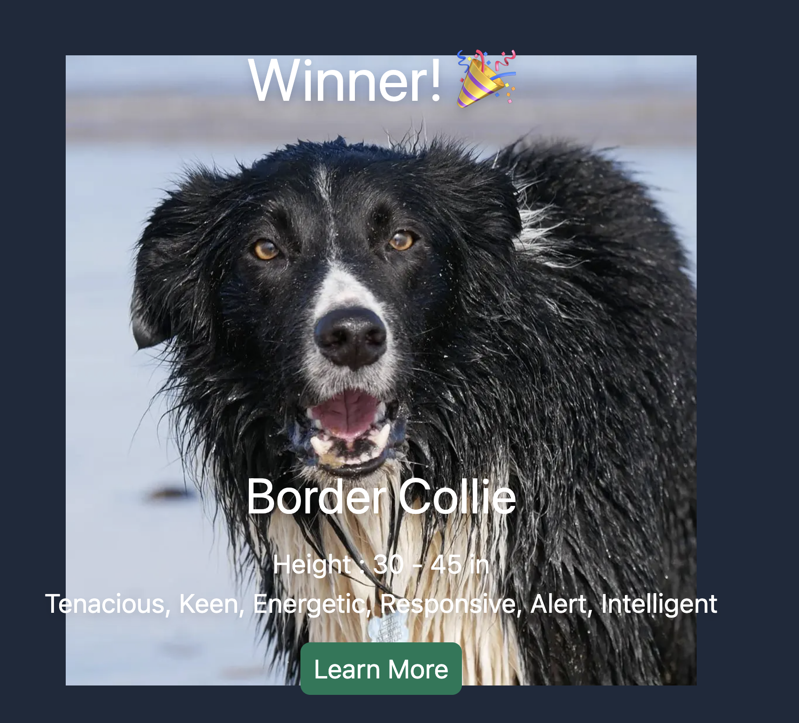

# Doggy Derby

  
    

Play the tournament with a round of 16 featuring your favorite dog breeds. It randomly selects 16 different dog breeds from [The Dog API](https://www.thedogapi.com). You can see the final winner along with their information and a link to their Wikipedia page.

## Users can...
- click to choose a winner for tournament
- see the winner with breed information

## Built With...
- [`Next.js`](https://nextjs.org/)
- [`create-next-app`](https://github.com/vercel/next.js/tree/canary/packages/create-next-app)
- [`The Dog API`](https://www.thedogapi.com)
- `Tailwind`

## Future Development
- [ ] Add more rounds to the tournament
- [ ] Add more competitions other than dogs
- [ ] Add database to store winners, favorites, and other information